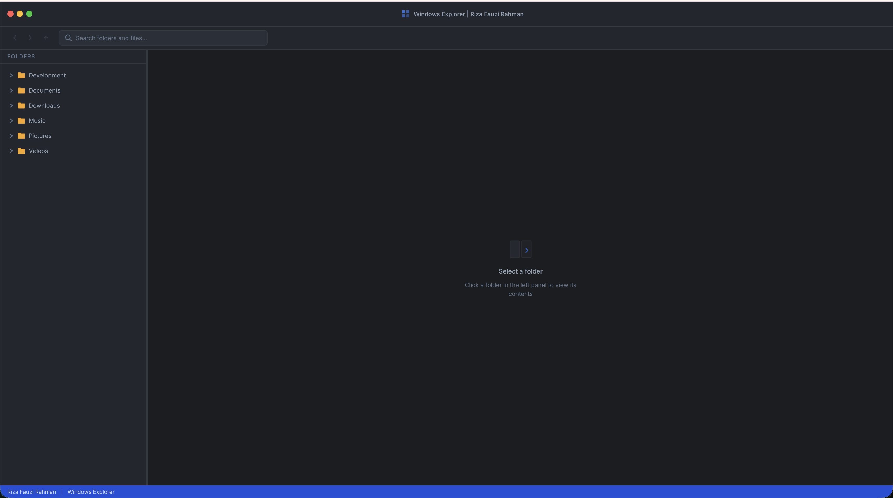
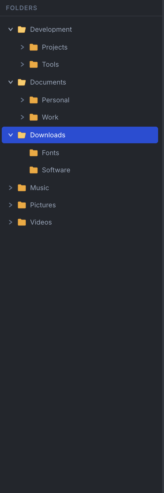
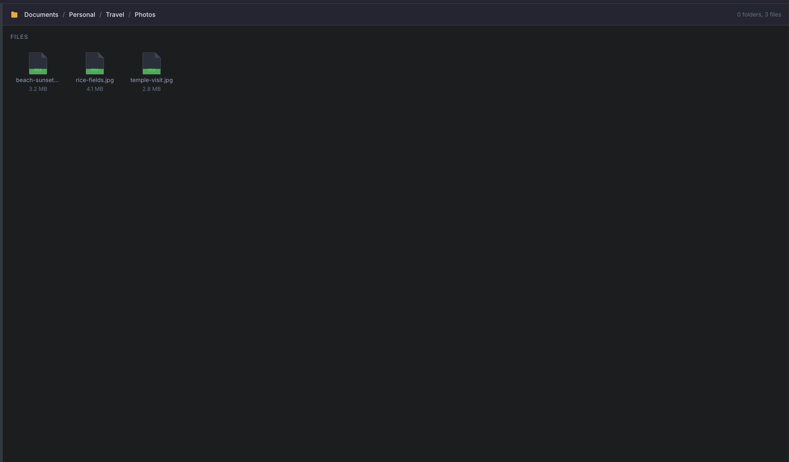
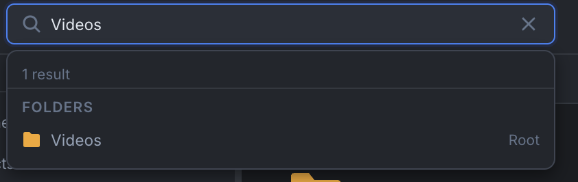
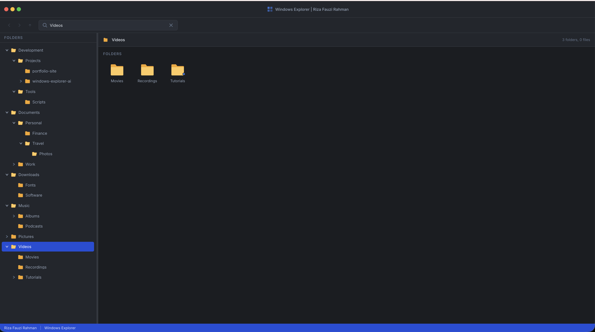
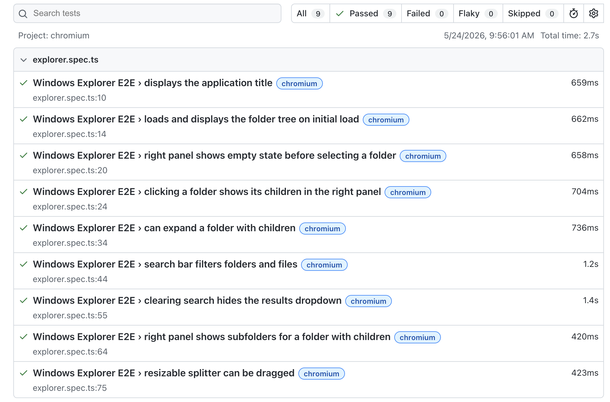

# Windows Explorer

A full-stack Windows Explorer-like web application built as a Bun monorepo. The application displays a folder tree, a resizable explorer layout, folder and file contents, and search across folders and files.

This project is designed as a clean, maintainable, and production-conscious implementation of a file explorer interface. It emphasizes clear architecture, typed API contracts, database-backed data access, test coverage, and pragmatic scalability trade-offs.

---

## Table of Contents

- [Tech Stack](#tech-stack)
- [Project Structure](#project-structure)
- [Prerequisites](#prerequisites)
- [Environment Setup](#environment-setup)
- [Install](#install)
- [Development](#development)
- [Database](#database)
- [Testing](#testing)
- [Build](#build)
- [API](#api)
- [Architecture](#architecture)
- [Data Model](#data-model)
- [Database Indexing Strategy](#database-indexing-strategy)
- [Scalability and Performance](#scalability-and-performance)
- [Engineering Trade-offs](#engineering-trade-offs)
- [Validation](#validation)
- [Error Handling](#error-handling)
- [Security Considerations](#security-considerations)
- [Observability](#observability)
- [Production Notes](#production-notes)
- [Known Limitations](#known-limitations)
- [Screenshots](#screenshots)

---

## Tech Stack

| Layer | Technology |
| --- | --- |
| Runtime and package manager | Bun |
| Backend | Elysia, TypeScript |
| Database | PostgreSQL, Drizzle ORM |
| Frontend | Vue 3, Composition API, Pinia, Vite |
| Shared contracts | TypeScript workspace package |
| Testing | Bun test, Vitest, Playwright |
| Local services | Docker Compose |

---

## Project Structure

```text
.
├── apps
│   ├── backend
│   │   ├── src/app.ts                    # Elysia app composition
│   │   ├── src/index.ts                  # Backend server entrypoint
│   │   ├── src/application               # Services and repository interfaces
│   │   ├── src/infrastructure            # Database, migrations, repositories
│   │   ├── src/presentation/http/v1      # HTTP routes
│   │   └── tests                         # Backend unit and integration tests
│   └── frontend
│       ├── src/app                       # App shell and layout
│       ├── src/features                  # Explorer, folder tree, search, contents
│       ├── src/shared                    # API client and shared UI components
│       └── src/tests                     # Frontend and E2E tests
├── packages/shared                       # Shared DTO and API response types
├── docker-compose.yml                    # Local PostgreSQL
├── .env.example                          # Environment template
└── package.json                          # Root workspace scripts
```

The repository is organized as a workspace-based monorepo. Backend, frontend, and shared API contracts are separated to keep ownership clear while still allowing type reuse across application boundaries.

---

## Prerequisites

- Bun 1.3 or newer
- Docker and Docker Compose
- PostgreSQL client tools are optional; the app uses Docker Compose for local PostgreSQL

---

## Environment Setup

Create a local `.env` file from the template:

```bash
cp .env.example .env
```

The root scripts load `.env` explicitly with `--env-file=.env`. Use the same filename for local development and change the values inside the file for the target environment.

Important variables:

| Variable | Purpose |
| --- | --- |
| `DATABASE_URL` | Backend and Drizzle PostgreSQL connection string |
| `POSTGRES_*` | Docker Compose PostgreSQL configuration |
| `BACKEND_HOST` | Elysia listen host |
| `BACKEND_PORT` | Elysia listen port |
| `FRONTEND_URL` | Allowed CORS origin for the backend |
| `VITE_API_BASE_URL` | Frontend API base URL |
| `DB_LOG_QUERY` | Set to `true` to print Drizzle SQL queries |

The real `.env` file is ignored by Git. Commit changes to `.env.example` when the required variable list changes.

---

## Install

Install workspace dependencies from the repository root:

```bash
bun install
```

Start the local database:

```bash
docker compose up -d
```

Run migrations and seed data:

```bash
bun run db:setup
```

---

## Development

Start backend and frontend together:

```bash
bun run dev
```

This starts the PostgreSQL Docker container first, runs database migrations, then starts the backend and frontend dev servers. It does not run the seed script automatically because seeding clears and recreates the sample data.

Default local URLs:

- Frontend: `http://localhost:5173`
- Backend: `http://localhost:3001`
- Health check: `http://localhost:3001/health`
- Swagger docs: `http://localhost:3001/docs`

You can also run each app directly:

```bash
bun run --cwd apps/backend dev
bun run --cwd apps/frontend dev
```

When running app-level scripts directly, make sure the required environment variables are available. Root scripts already load `.env`.

---

## Database

Run PostgreSQL with Docker Compose:

```bash
bun run docker:up
```

Check database container status:

```bash
docker compose ps
```

View database logs:

```bash
bun run docker:logs
```

Stop the database:

```bash
bun run docker:down
```

Reset the local database volume:

```bash
docker compose down -v
bun run docker:up
bun run db:setup
```

Generate migrations after schema changes:

```bash
bun run --cwd apps/backend db:generate
```

Apply migrations:

```bash
bun run db:migrate
```

Seed the sample Windows Explorer data:

```bash
bun run db:seed
```

Run migrations and seed data together:

```bash
bun run db:setup
```

Open Drizzle Studio:

```bash
bun run db:studio
```

---

## Testing

Run all workspace tests:

```bash
bun run test
```

Run backend tests:

```bash
bun run --env-file=.env --cwd apps/backend test
```

Backend integration tests use the real database. Make sure PostgreSQL is running, migrations have been applied, and seed data exists before running them.

Run frontend unit tests:

```bash
bun run --cwd apps/frontend test
```

Run frontend type checks:

```bash
bun run --cwd apps/frontend typecheck
```

Run E2E tests:

```bash
bun run dev
bun run test:e2e
```

The Playwright tests target `http://localhost:5173`. The frontend expects the backend API to be available through the Vite `/api` proxy.

If Playwright reports that the browser executable is missing, install the local browser binary:

```bash
bun run playwright:install
```

---

## Build

Build all apps:

```bash
bun run build
```

Build only the frontend:

```bash
bun run --cwd apps/frontend build
```

The backend runs TypeScript directly with Bun; its Docker image starts `apps/backend/src/index.ts`.

---

## API

Base path: `/api/v1`

| Method | Path | Description |
| --- | --- | --- |
| `GET` | `/health` | Backend health check |
| `GET` | `/api/v1/folders` | Return all folders as a flat tree list |
| `GET` | `/api/v1/folders/root` | Return root-level folders |
| `GET` | `/api/v1/folders/:id/children` | Return direct child folders and files |
| `GET` | `/api/v1/search?q=term` | Search folders and files |

Swagger documentation is exposed at `/docs` when the backend is running.

### Example: `GET /api/v1/folders/:id/children`

```json
{
  "data": {
    "folders": [
      {
        "id": "6bdb3f6f-4a77-4d31-b5b2-39de1dcf8f2a",
        "parentId": "ea2d7e8a-6db8-4f3b-8f1f-7b6b1e7e81d1",
        "name": "Documents",
        "hasChildren": true,
        "createdAt": "2026-05-24T10:00:00.000Z",
        "updatedAt": "2026-05-24T10:00:00.000Z"
      }
    ],
    "files": [
      {
        "id": "38debd67-4e24-4692-9981-87f7293b2929",
        "folderId": "ea2d7e8a-6db8-4f3b-8f1f-7b6b1e7e81d1",
        "name": "resume.pdf",
        "size": 120000,
        "mimeType": "application/pdf",
        "createdAt": "2026-05-24T10:00:00.000Z",
        "updatedAt": "2026-05-24T10:00:00.000Z"
      }
    ]
  }
}
```

### Example: `GET /api/v1/search?q=doc`

```json
{
  "data": {
    "folders": [
      {
        "id": "6bdb3f6f-4a77-4d31-b5b2-39de1dcf8f2a",
        "parentId": null,
        "name": "Documents",
        "hasChildren": true
      }
    ],
    "files": [
      {
        "id": "38debd67-4e24-4692-9981-87f7293b2929",
        "folderId": "6bdb3f6f-4a77-4d31-b5b2-39de1dcf8f2a",
        "name": "project-doc.md",
        "size": 4200,
        "mimeType": "text/markdown"
      }
    ]
  }
}
```

---

## Architecture

The backend follows a layered structure:

- **Presentation**: Elysia route modules under `presentation/http/v1`
- **Application**: business services and repository interfaces
- **Infrastructure**: Drizzle database client, schema, migrations, and repository implementations
- **Composition root**: `src/app.ts` wires repositories, services, routes, CORS, Swagger, and error handling
- **Runtime entrypoint**: `src/index.ts` calls `app.listen`

The frontend is organized by feature:

- **app**: application shell and layout
- **features/folder-tree**: tree navigation and expansion state
- **features/folder-contents**: right-panel folder and file listings
- **features/search**: search UI and search composable
- **features/explorer**: Pinia store for selected folder and explorer state
- **shared**: API client and reusable UI components

Shared DTOs live in `packages/shared` so the frontend and backend can agree on API response shapes.

### Design Goals

- Keep backend domain logic independent from HTTP route definitions
- Keep database access behind repository interfaces
- Keep frontend state predictable and testable through composables and Pinia
- Keep API contracts explicit and reusable through the shared workspace package
- Keep the implementation simple enough for the assessment while documenting production trade-offs clearly

---

## Data Model

```text
folders
├── id          UUID PK
├── parent_id   UUID FK → folders.id (NULL = root)
├── name        TEXT
├── created_at  TIMESTAMPTZ
└── updated_at  TIMESTAMPTZ

files
├── id          UUID PK
├── folder_id   UUID FK → folders.id
├── name        TEXT
├── size        BIGINT (bytes)
├── mime_type   TEXT
├── created_at  TIMESTAMPTZ
└── updated_at  TIMESTAMPTZ
```

### Why adjacency list?

The folder hierarchy uses an adjacency list model where each folder stores a reference to its parent folder.

This model is a good fit because it provides:

- Simple writes for folder creation and movement
- Unlimited nesting depth without schema changes
- Efficient direct child lookup with an index on `parent_id`
- Recursive tree traversal through PostgreSQL recursive CTEs when needed

---

## Database Indexing Strategy

Recommended production indexes:

```sql
CREATE INDEX IF NOT EXISTS idx_folders_parent_id
ON folders(parent_id);

CREATE INDEX IF NOT EXISTS idx_files_folder_id
ON files(folder_id);

CREATE INDEX IF NOT EXISTS idx_folders_lower_name
ON folders(lower(name));

CREATE INDEX IF NOT EXISTS idx_files_lower_name
ON files(lower(name));
```

For scalable partial or fuzzy search, enable PostgreSQL trigram search:

```sql
CREATE EXTENSION IF NOT EXISTS pg_trgm;

CREATE INDEX IF NOT EXISTS idx_folders_name_trgm
ON folders USING gin (name gin_trgm_ops);

CREATE INDEX IF NOT EXISTS idx_files_name_trgm
ON files USING gin (name gin_trgm_ops);
```

These indexes are especially important if search uses case-insensitive matching such as `ILIKE '%term%'`.

---

## Scalability and Performance

### Current Approach

- The folder tree endpoint returns a flat list of folders
- The frontend transforms the flat list into a tree structure in O(n)
- Direct folder contents are loaded lazily when a folder is selected
- Search returns separate folder and file result groups
- Search is limited to 100 results to keep responses small

### Performance Characteristics

| Area | Current Behavior | Notes |
| --- | --- | --- |
| Initial tree load | O(n) | Loads all folders into the frontend for the left tree |
| Tree build | O(n) | Frontend maps folders by parent-child relationship |
| Folder selection | O(1) query pattern | Loads direct children of the selected folder |
| Search | Depends on index strategy | Basic `ILIKE` can scan; add trigram or full-text indexes for production |
| Frontend memory | O(n) | Memory grows with number of loaded folders |

### Production Scaling Recommendations

For larger datasets, the tree should be loaded progressively:

- Load root folders first
- Load child folders only when a tree node is expanded
- Cache expanded folder children in the frontend store
- Add pagination or cursor-based loading for folders with many children
- Add database indexes for `parent_id`, `folder_id`, and searchable names
- Use PostgreSQL trigram indexes or full-text search for scalable search

The current implementation is intentionally simple and suitable for the take-home scope. The documented production path keeps the same data model while improving read scalability.

---

## Engineering Trade-offs

### Adjacency List vs Nested Set vs Materialized Path

This project uses an adjacency list because it keeps writes simple and supports unlimited folder depth.

| Model | Read Performance | Write Complexity | Best For |
| --- | --- | --- | --- |
| Adjacency List | Good with recursive CTEs and indexes | Simple | General-purpose tree structure |
| Nested Set | Fast subtree reads | Expensive inserts and moves | Mostly static trees |
| Materialized Path | Fast prefix subtree reads | Requires path updates on move | Read-heavy hierarchy |

For this use case, adjacency list is a practical default because folder creation, movement, and direct child lookup should remain simple.

### Flat API Response vs Nested API Response

The folder tree endpoint returns a flat list instead of deeply nested JSON.

Benefits:

- Avoids large recursive payloads
- Keeps API response shape simple
- Allows the frontend to build the tree efficiently
- Prevents backend response generation from becoming tightly coupled to UI rendering

Trade-off:

- The frontend needs to transform the flat list into a tree map
- Very large trees may require progressive loading instead of full-tree loading

### Bun Runtime

Bun is used as both runtime and package manager to simplify local development and reduce toolchain overhead.

For production usage, the deployment environment should verify:

- Runtime compatibility
- Observability integration
- Container behavior
- Dependency compatibility
- CI/CD support

---

## Validation

Validation should be enforced at the API boundary.

Recommended validation rules:

- Folder IDs must be valid UUIDs
- Empty search queries should return an empty result or validation error consistently
- Search queries should be trimmed before execution
- Search queries should have a maximum length to avoid expensive database operations
- API responses should follow the shared DTO contracts
- Unknown routes should return a consistent `404` response

---

## Error Handling

All API errors should follow a consistent response shape:

```json
{
  "error": {
    "code": "FOLDER_NOT_FOUND",
    "message": "Folder was not found",
    "requestId": "req_123"
  }
}
```

Common error categories:

| Code | Meaning |
| --- | --- |
| `BAD_REQUEST` | Invalid request input |
| `VALIDATION_ERROR` | Request failed schema or parameter validation |
| `NOT_FOUND` | Requested resource does not exist |
| `INTERNAL_SERVER_ERROR` | Unexpected server error |

The backend should avoid leaking database errors directly to the client. Internal errors should be logged server-side and mapped to safe client-facing responses.

---

## Security Considerations

Authentication and authorization are not included because they are outside the assessment requirement.

For production, add:

- Authentication and authorization
- Per-route access control
- Rate limiting for search endpoints
- Request size limits
- CORS allowlist per environment
- Structured request logging
- Input validation at API boundaries
- Secure secret management
- Dependency scanning in CI

---

## Observability

Production deployment should include:

- Structured JSON logs
- Request ID per API call
- Latency logging per endpoint
- Database query duration tracking
- Health and readiness endpoints
- Error monitoring integration
- Frontend error tracking
- Basic usage metrics for tree loading, folder selection, and search

Recommended metrics:

| Metric | Purpose |
| --- | --- |
| API latency by endpoint | Detect slow routes |
| Database query duration | Detect slow or missing indexes |
| Search query latency | Validate search performance |
| Error rate | Monitor backend reliability |
| Frontend load time | Monitor user experience |
| E2E test pass rate | Track release confidence |

---

## Implementation Notes

- Code clarity: the codebase is split by responsibility, with backend presentation, application, and infrastructure layers separated from frontend feature modules.
- Shared contracts: API response types are centralized in `packages/shared` to keep frontend and backend contracts explicit.
- Data structure: folders are represented as a flat list with `id`, `parentId`, metadata, and `hasChildren` fields.
- Algorithm: folder navigation uses parent-child relationships to fetch root folders, direct children, and search results without loading unnecessary nested structures.
- Search behavior: search trims empty input early and queries folders and files separately before returning grouped results.
- Testing: unit, integration, frontend, and E2E tests are included for the main workflows.

---

## Production Notes

Production should inject environment variables through the deployment platform or secret manager. A `.env` file may be used locally or inside controlled container environments, but real production secrets should not be committed or baked into images.

Required production configuration:

- Use a production `DATABASE_URL`
- Set `NODE_ENV=production`
- Set `BACKEND_HOST=0.0.0.0` when running inside a container
- Set `FRONTEND_URL` to the deployed frontend origin
- Set `VITE_API_BASE_URL` to the deployed API path or URL
- Disable verbose SQL logging unless debugging a controlled environment

The repository includes Dockerfiles for the backend and frontend. The current `docker-compose.yml` is focused on local PostgreSQL.

Recommended production additions:

- CI/CD pipeline
- Database migration step before deployment
- Container health checks
- Readiness checks
- Centralized logging
- Error monitoring
- Secret management
- Backup and restore strategy for PostgreSQL

---

## Known Limitations

- Search currently uses basic name matching and is not ranked
- Initial tree load fetches all folders, which may not be ideal for very large datasets
- No authentication or authorization layer is included
- No file upload or binary storage is implemented
- Folder move, rename, delete, and file operations are outside the current scope
- No pagination is implemented for folders with very large child lists
- No audit logging is included for folder or file changes

These limitations are acceptable for the assessment scope, but they define the next areas to address before production usage.

---

## Screenshots

### Home Page



### Folder Tree



### Folder Contents



### Search



### Search Results



### Test Coverage



---

## Final Notes

This implementation intentionally balances assessment scope with production-oriented engineering practices.

The application is small enough to review quickly, but the structure supports future growth through clear boundaries between HTTP routes, application services, repositories, shared contracts, and frontend features.